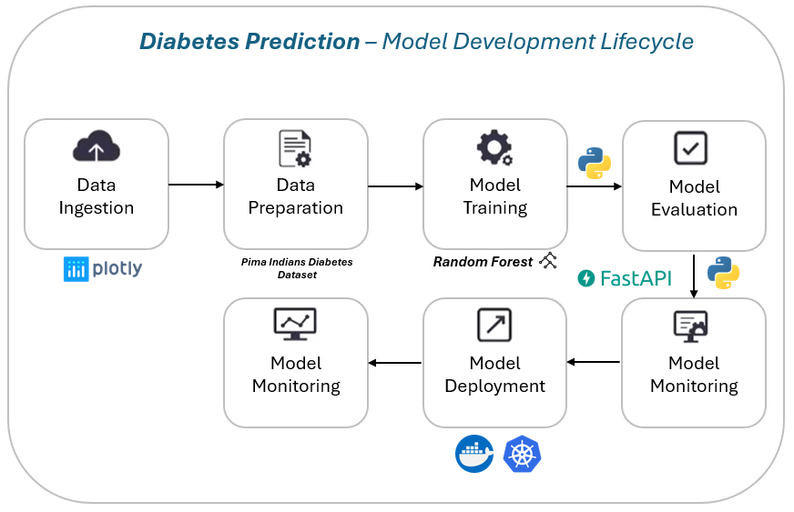
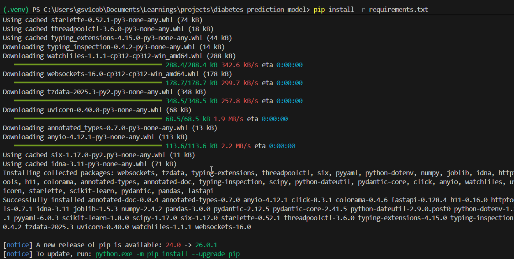
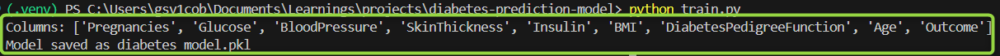
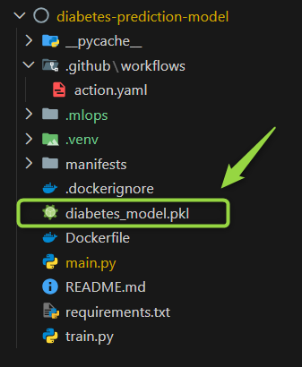
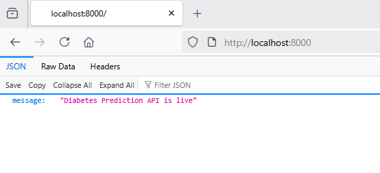
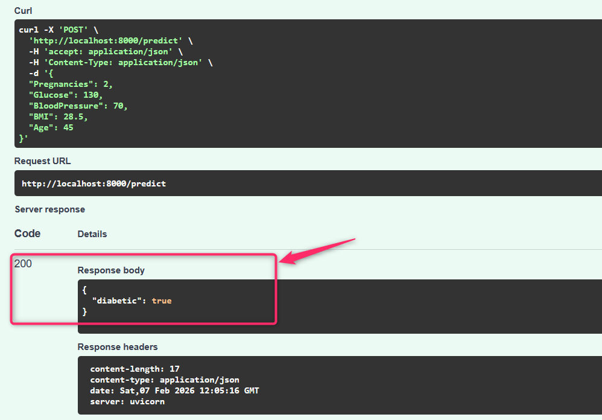
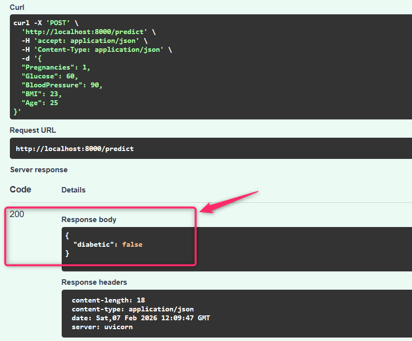

# Diabetes Prediction Model – My First MLOps Project (FastAPI + Docker + K8s)
This project helps to predicting whether a person is diabetic based on health metrics and also explain how the model is built and deployment in Kubernetes.

## What we will do in this project ?
- Model Training
- Building the Model locally
- API Deployment with FastAPI
- Dockerization
- Kubernetes Deployment

## Model Workflow


## Problem Statement
Predict if a person is diabetic based on:
- Pregnancies
- Glucose
- Blood Pressure
- BMI
- Age

We use a Random Forest Classifier trained on the **Pima Indians Diabetes Dataset**

## How to run the model locally ?
1. Clone the Repo
```bash
git clone https://github.com/cloudvignesh/diabetes-prediction-model.git
cd diabetes-prediction-model
```
2. Create Virtual Environment
```bash
python3 -m venv .mlops
source .mlops/bin/activate
```
3. Install Dependencies
```bash
pip install -r requirements.txt
```


4. Train the Model
```bash
python train.py
```



5. Run the Flask API locally to serve the model
```bash
uvicorn main:app --reload
```

6. Test the Model
```json
{
  "Pregnancies": 2,
  "Glucose": 130,
  "BloodPressure": 70,
  "BMI": 28.5,
  "Age": 45
}
```
**Positive test-case:**


**Negetive test-case:**

## Follow the below steps to dockerize the flask app
1. Build the Docker Image
```bash
docker build -t diabetes-prediction-model .
```
2. Run the Docker Container
```bash
docker run -p 8000:8000 diabetes-prediction-model
```
## Follow the below steps to deploy the flask app into Kubernetes
Either you can use minikube or kind to run the kubernetes cluster locally. (or) Go with Cloud Managed Service like EKS or AKS.
```bash
kubectl apply -f manifests/deployment.yaml
```